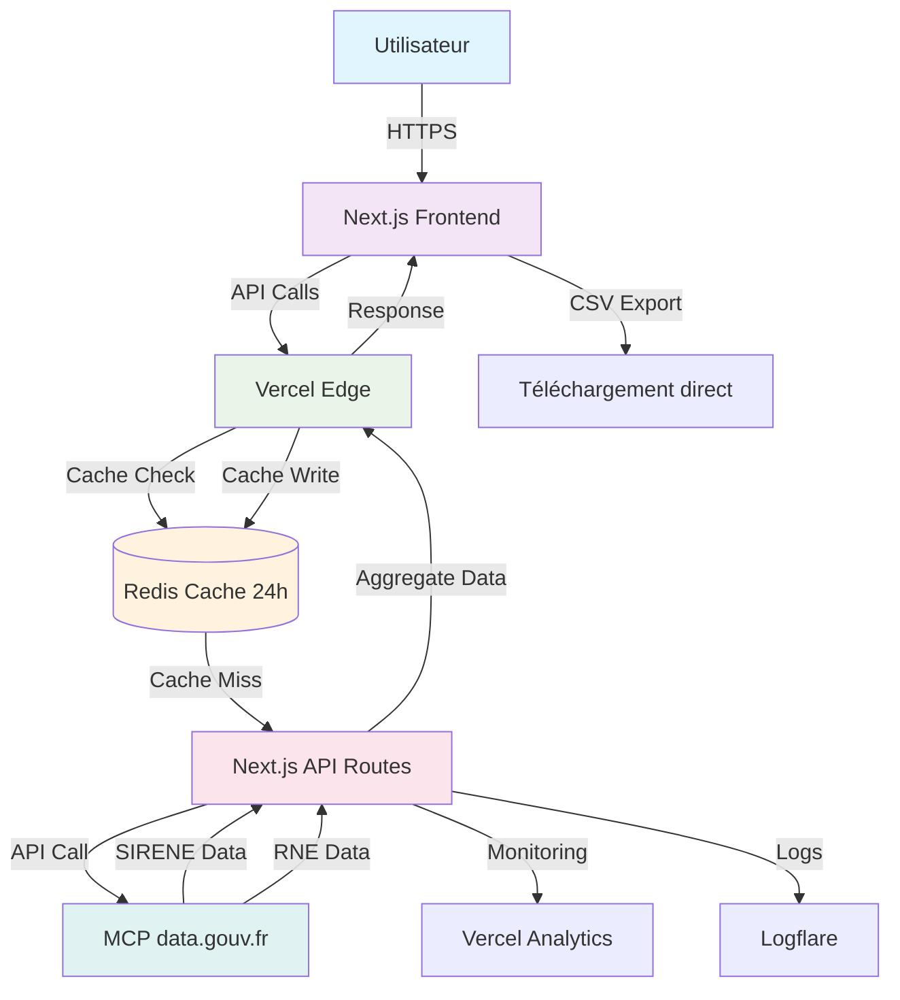

# Architecture Technique - Lean Lead Machine MVP V1

## 1. Vue d'Ensemble

### 1.1 Principes d'Architecture
- **Stateless** : Pas de session utilisateur persistante
- **Serverless** : Scalabilité automatique avec Vercel
- **Cache-First** : Performance via cache Redis 24h
- **RGPD by Design** : Pas de stockage données personnelles
- **API-Centric** : Backend comme proxy MCP intelligent

### 1.2 Stack Technologique
```
Frontend:    Next.js 14 (App Router) + Tailwind CSS
Backend:     Next.js API Routes + Node.js
Cache:       Redis (Supabase Redis) / Vercel KV
API Gateway: Vercel Edge Functions
Database:    Aucune (stateless) / Supabase pour cache
Monitoring:  Vercel Analytics + Logflare
Payments:    Stripe (V2)
```

## 2. Diagramme d'Architecture



## 3. Composants Détaillés

### 3.1 Frontend (Next.js 14)

#### Structure
```
frontend/
├── app/
│   ├── layout.tsx           # Layout racine
│   ├── page.tsx             # Page d'accueil/recherche
│   ├── entreprise/[siren]/page.tsx  # Fiche entreprise
│   ├── api/                 # Routes API (proxy)
│   │   ├── search/route.ts
│   │   ├── entreprise/route.ts
│   │   ├── export/route.ts
│   │   └── suggestions/route.ts
│   └── components/
│       ├── SearchForm.tsx   # Formulaire recherche
│       ├── ResultsTable.tsx # Tableau résultats
│       ├── CompanyCard.tsx  # Carte entreprise
│       ├── ExportButton.tsx # Bouton export
│       └── ErrorDisplay.tsx # Affichage erreurs
├── lib/
│   ├── api.ts              # Client API typé
│   ├── cache.ts            # Gestion cache client
│   └── validation.ts       # Validation formulaires
└── styles/
    └── globals.css         # Styles Tailwind
```

#### Technologies Frontend
- **Next.js 14** : App Router, Server Components
- **TypeScript** : Typage strict
- **Tailwind CSS** : Styling utility-first
- **React Hook Form** : Gestion formulaires
- **Zod** : Validation schémas
- **React Query** : Cache client-side (optionnel)
- **CSV Export** : `papaparse` pour génération CSV côté client

### 3.2 Backend (Next.js API Routes)

#### Endpoints API
```typescript
// Structure des endpoints
GET    /api/search?codePostal=75001&rayon=10&codeNaf=62.01Z
GET    /api/entreprise/:siren
POST   /api/export (body: filters)
GET    /api/suggestions/naf?q=info
GET    /api/suggestions/villes?q=par
GET    /api/health           # Health check
```

#### Services Backend
```typescript
// services/mcp.service.ts
class MCPService {
  async searchCompanies(filters: SearchFilters): Promise<Company[]>
  async getCompanyDetails(siren: string): Promise<CompanyDetails>
  async getSuggestions(type: 'naf' | 'ville', query: string): Promise<Suggestion[]>
}

// services/cache.service.ts  
class CacheService {
  async get(key: string): Promise<any>
  async set(key: string, value: any, ttl: number): Promise<void>
  async del(key: string): Promise<void>
  async generateCacheKey(filters: SearchFilters): Promise<string>
}

// services/export.service.ts
class ExportService {
  async generateCSV(companies: Company[]): Promise<Buffer>
  validateExportLimit(companies: Company[]): boolean
  formatCompanyForExport(company: Company): ExportRow
}
```

### 3.3 Cache Layer (Redis)

#### Stratégie de Cache
```typescript
// Clés de cache
`search:${hash(filters)}`           // Résultats recherche (24h)
`entreprise:${siren}`               // Fiche entreprise (24h)  
`suggest:naf:${query}`              // Suggestions NAF (6h)
`suggest:ville:${query}`            // Suggestions villes (6h)
`export:${hash(filters)}`           // Export CSV (1h)

// TTL (Time To Live)
const TTL = {
  SEARCH: 24 * 60 * 60,      // 24h
  COMPANY: 24 * 60 * 60,     // 24h
  SUGGESTION: 6 * 60 * 60,   // 6h
  EXPORT: 60 * 60,           // 1h
};
```

#### Implémentation Redis
```typescript
// Utilisation avec Supabase Redis ou Vercel KV
import { Redis } from '@upstash/redis';

const redis = new Redis({
  url: process.env.REDIS_URL,
  token: process.env.REDIS_TOKEN,
});

// Ou Vercel KV
import { kv } from '@vercel/kv';
```

### 3.4 Intégration MCP

#### Flux de Données
```typescript
// 1. Appel SIRENE pour données entreprises
GET https://mcp.data.gouv.fr/sirene/companies
Params: codePostal, codeNaf, trancheEffectif

// 2. Appel RNE pour dirigeants (par SIREN)
GET https://mcp.data.gouv.fr/rne/dirigeants/{siren}

// 3. Aggrégation côté backend
const companyData = await sireneApi.getCompany(siren);
const directorsData = await rneApi.getDirectors(siren);

return {
  ...companyData,
  dirigeants: directorsData
};
```

#### Gestion des Erreurs MCP
```typescript
try {
  return await mcpService.search(filters);
} catch (error) {
  if (error.code === 'TIMEOUT') {
    // Retourner cache si disponible
    const cached = await cacheService.get(cacheKey);
    if (cached) return cached;
    
    throw new Error('Service MCP temporairement indisponible');
  }
  
  if (error.code === 'RATE_LIMIT') {
    throw new Error('Limite de requêtes atteinte. Réessayez dans 1 minute.');
  }
  
  throw error;
}
```

## 4. Flux de Données

### 4.1 Recherche d'Entreprises
```
1. User submit form → Frontend validation
2. Frontend → /api/search avec filters
3. API Gateway → Check cache Redis
4. Cache hit → Return cached data (fast path)
5. Cache miss → Next.js API Routes
6. API Routes → MCP data.gouv.fr
7. MCP → Return SIRENE data
8. API Routes → Cache data in Redis (24h)
9. API Routes → Return to Frontend
10. Frontend → Display results
```

### 4.2 Export CSV
```
1. User click "Exporter CSV"
2. Frontend → /api/export avec filters
3. API Routes → Validate limit (500 max)
4. API Routes → Get companies from cache/API
5. API Routes → Generate CSV buffer
6. API Routes → Set response headers:
   Content-Type: text/csv; charset=utf-8
   Content-Disposition: attachment; filename="..."
7. Frontend → Browser download
```

### 4.3 Affichage Fiche Entreprise
```
1. User click company in list
2. Frontend → /api/entreprise/:siren
3. Cache check → If cached, return
4. Cache miss → Parallel calls:
   - MCP SIRENE (company data)
   - MCP RNE (directors data)
5. Aggregate data → Cache (24h) → Return
6. Frontend → Render company details page
```

## 5. Sécurité

### 5.1 RGPD Compliance
```typescript
// Design stateless = pas de stockage
interface SearchSession {
  // Pas de session persistante
  // Toutes les données en cache temporaire
}

// Cache TTL strict
const MAX_CACHE_TTL = 24 * 60 * 60; // 24h

// Logs anonymisés
const logData = {
  timestamp: Date.now(),
  action: 'search',
  filters: {
    codePostal: '750**', // Masqué
    codeNaf: '62.**Z',   // Partiel
    resultCount: 42
  },
  // Pas de SIREN dans les logs
};
```

### 5.2 API Security
```typescript
// Rate limiting
const rateLimit = {
  windowMs: 60 * 1000, // 1 minute
  max: 100, // 100 requêtes par minute
  message: 'Trop de requêtes. Réessayez dans 1 minute.'
};

// CORS configuration
const corsOptions = {
  origin: process.env.NEXT_PUBLIC_APP_URL,
  methods: ['GET', 'POST'],
  allowedHeaders: ['Content-Type'],
  maxAge: 86400 // 24h
};

// Input validation
const searchSchema = z.object({
  codePostal: z.string().regex(/^[0-9]{5}$/),
  rayonKm: z.number().min(1).max(100).optional(),
  codeNaf: z.string().regex(/^[0-9]{2}\.[0-9]{2}[A-Z]$/).optional(),
  trancheEffectif: z.enum(['00', '01', '02', '03', '11', '12', '21', '22', '31', '32', '41', '42', '51', '52', '53']).optional()
});
```

### 5.3 Infrastructure Security
- **HTTPS** : TLS 1.3 via Vercel
- **WAF** : Vercel Web Application Firewall
- **DDoS Protection** : Vercel Edge Protection
- **Secrets** : Environment variables, pas de hardcoding
- **Dependencies** : Regular security updates via Dependabot

## 6. Performance

### 6.1 Optimisations
```typescript
// 1. Cache agressif
const CACHE_STRATEGY = {
  search: '24h',
  company: '24h',
  suggestions: '6h'
};

// 2. Pagination
const PAGINATION = {
  defaultLimit: 50,
  maxLimit: 500
};

// 3. Lazy loading
const LAZY_LOAD = {
  companyDetails: true, // Chargement à la demande
  suggestions: true     // Auto-complétion lazy
};

// 4. Compression
const COMPRESSION = {
  api: 'gzip',
  assets: 'brotli'
};
```

### 6.2 Métriques Cibles
- **API Response Time** : < 1s P95
- **Cache Hit Rate** : > 70%
- **Time to First Byte** : < 200ms
- **First Contentful Paint** : < 2s
- **CSV Generation** : < 5s pour 500 lignes

### 6.3 Monitoring
```typescript
// Métriques à tracker
const metrics = {
  performance: {
    mcp_latency: 'histogram',
    cache_hit_rate: 'gauge',
    export_generation_time: 'histogram'
  },
  business: {
    searches_per_day: 'counter',
    exports_generated: 'counter',
    unique_users: 'gauge'
  },
  errors: {
    mcp_errors: 'counter',
    validation_errors: 'counter',
    export_errors: 'counter'
  }
};
```

## 7. Déploiement

### 7.1 Environnements
```yaml
# Environnements
development:
  branch: main
  url: https://dev.leanleadmachine.com
  cache: Redis local (24h)

staging:
  branch: staging
  url: https://staging.leanleadmachine.com  
  cache: Supabase Redis (24h)

production:
  branch: production
  url: https://leanleadmachine.com
  cache: Supabase Redis (24h) + Vercel KV
```

### 7.2 CI/CD Pipeline
```yaml
# GitHub Actions
name: Deploy
on: [push]

jobs:
  test:
    runs-on: ubuntu-latest
    steps:
      - uses: actions/checkout@v3
      - run: npm ci
      - run: npm test
      - run: npm run build

  deploy-dev:
    needs: test
    if: github.ref == 'refs/heads/main'
    runs-on: ubuntu-latest
    steps:
      - uses: actions/checkout@v3
      - run: vercel deploy --prod --token=$VERCEL_TOKEN

  deploy-prod:
    needs: test
    if: github.ref == 'refs/heads/production'
    runs-on: ubuntu-latest
    steps:
      - uses: actions/checkout@v3
      - run: vercel deploy --prod --token=$VERCEL_TOKEN
```

### 7.3 Rollback Strategy
- **Vercel** : Instant rollback to previous deployment
- **Cache** : Redis data persists during rollback
- **Database** : No database = no migration issues
- **Monitoring** : Alert on error rate increase

## 8. Scaling

### 8.1 Horizontal Scaling
- **Frontend** : Vercel auto-scales
- **API** : Vercel Edge Functions auto-scale
- **Cache** : Redis cluster if needed
- **Limits** : Rate limiting prevents abuse

### 8.2 Vertical Scaling
- **Cache memory** : Upgrade Redis plan
- **API timeout** : Increase from 5s to 10s if needed
- **Export limit** : Increase from 500 to 1000 in V2

### 8.3 Cost Optimization
- **Vercel** : Hobby plan for MVP ($0)
- **Redis** : Supabase free tier (128MB)
- **Monitoring** : Vercel Analytics included
- **Bandwidth** : Vercel included 100GB

## 9. Backup & Disaster Recovery

### 9.1 Backup Strategy
- **Code** : GitHub (primary), Local (secondary)
- **Cache** : No backup needed (temporary data)
- **Environment** : .env in GitHub Secrets
- **Configuration** : Infrastructure as Code (Vercel)

### 9.2 Recovery Procedures
```typescript
// 1. MCP outage
if (mcpUnavailable) {
  return cachedData || errorMessage;
}

// 2. Redis outage
if (redisUnavailable) {
  bypassCache = true;
  callMCPDirectly();
}

// 3. Vercel outage
// - Rollback to previous deployment
// - Static fallback page on Cloudflare
```

## 10. Documentation Technique

### 10.1 API Documentation
```bash
# Générer documentation OpenAPI
npm run docs:generate

# Swagger UI disponible sur
https://api.leanleadmachine.com/docs
```

### 10.2 Runbook Opérationnel
```markdown
# Runbook - Incident Management

## Symptom: API slow (> 2s)
1. Check Vercel Analytics
2. Check Redis cache hit rate
3. Check MCP API status
4. Clear cache if corrupted

## Symptom: Export failing
1. Check CSV generation service
2. Validate 500 row limit
3. Check browser compatibility
4. Test with smaller dataset
```

---

**Version** : 1.0  
**Date** : 10 mars 2026  
**Maintenu par** : Équipe Technique  
**Prochaine revue** : Après déploiement MVP
